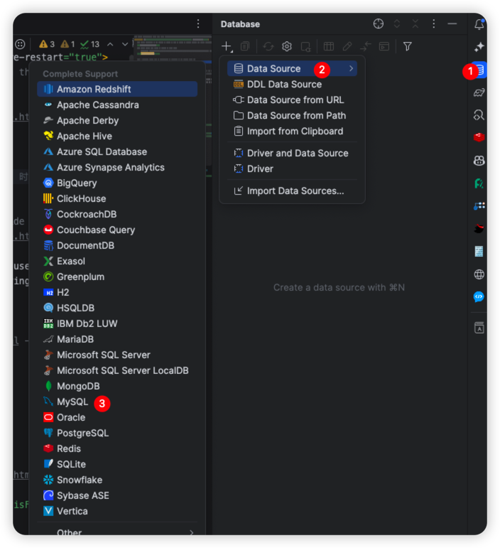
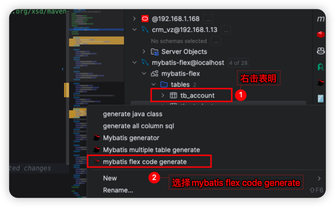
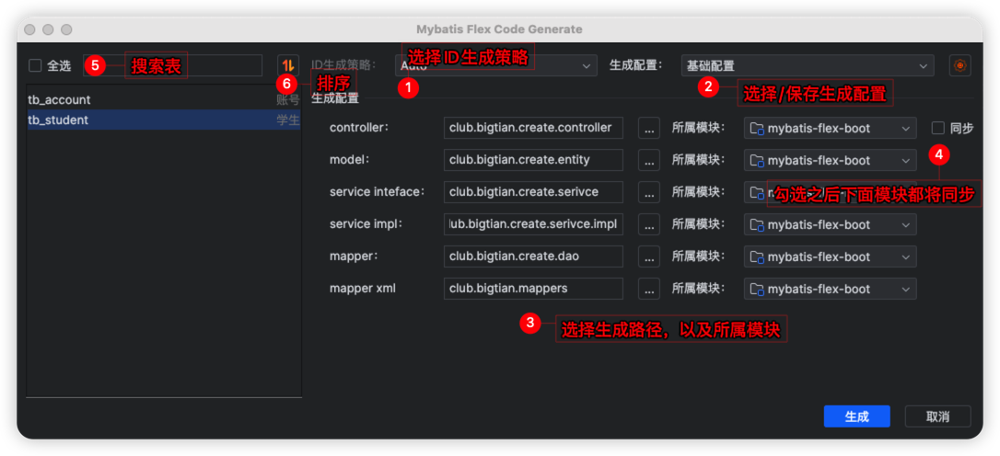
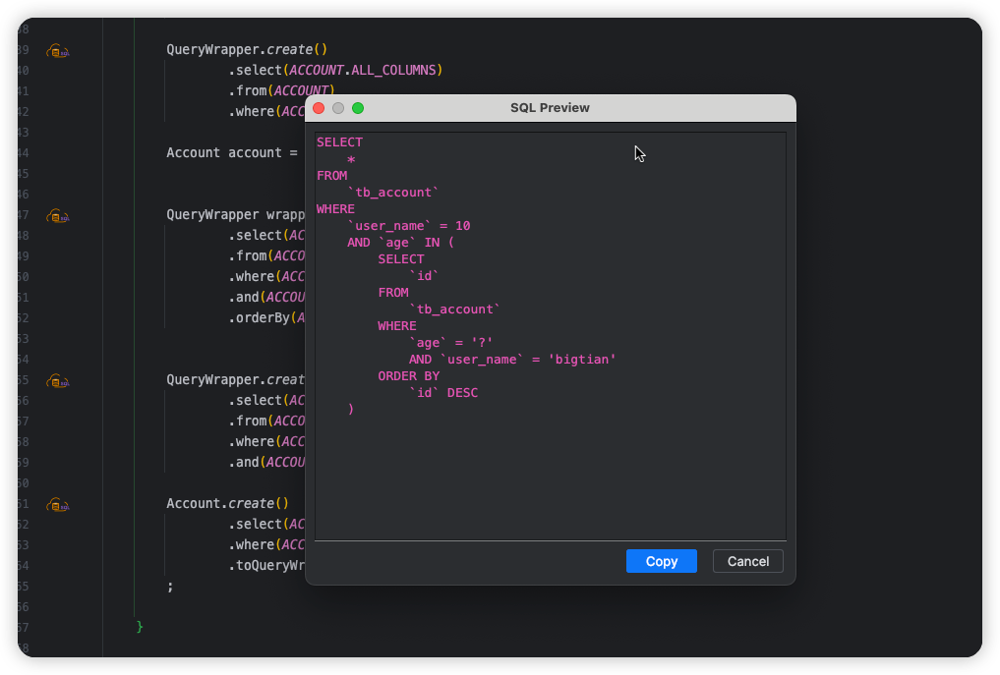

<h2 align="center">MybatisFlex-Helper</h2>

	<strong>代码提示、自动 APT，SQL 预览等特性</strong>

    
    
    

### 一、简介

`这是一款深度支持Mybatis-Flex的IDEA插件，它最大的亮点就是可以高度自定义代码生成模板，它可以快速根据表生成代码，可以使用导出/导入把配置分享给同事以便快速开发`

[插件详细文档](http://blog.bigtian.club/guide/mybatisFlex_Helper/) 									QQ群：872707845

​																						 

### 二、宗旨

致力于简化Mybatis-Flex用户操作繁琐且毫无意义的额外操作

### 三、代码生成

1、使用IDEA连接数据库

2、右击表名选择`mybatis flex code generate`

3、生成面板

4、设置面板

5、SQL预览

### 四、功能

1、APT自动编译

2、APT内容提示

3、SQL预览

### 五、视频演示

1 、[基础演示](https://www.bilibili.com/video/BV1yV411g7Yd/?vd_source=b6f434af852a6a39fcd34fc2de5cf431)

2 、[新增功能演示](https://www.bilibili.com/video/BV1hj411d7Rq/?vd_source=b6f434af852a6a39fcd34fc2de5cf431)

3 、[1.4.7版本新增功能演示](https://www.bilibili.com/video/BV1WX4y1j7VQ/)

### 六、请作者喝杯咖啡

### 七、打赏名单（礼轻情意重）

| 用户     | 金额      |
|--------|---------|
| *葛     | 0.01 元  |
| *🤫    | 3 元     |
| 说都不会话了 | 50 元    |
| **稳    | 9.9 元   |
| 阳灿     | 16.66 元 |
| 超然     | 9.9 元   |

### 八、鸣谢
1、感谢`jetbrains`公司对本项目的大力支持，提供免费使用许可

### 九、更新日志

#### 1.4.7.1-RELEASE

- 【修复】sql 预览icon丢失

#### 1.4.7-RELEASE

- 【新增】自定义类型映射
- 【新增】支持大部分 mybatis-flex.config 配置
- 【新增】自定义 model 父类
- 【新增】数据源，租户，乐观锁代码生成适配
- 【优化】支持在 service 实现中直接使用 query()、 queryChain()、updateChain()方法的 SQL 预览
- 【优化】支持单元测试预览 SQL

#### 1.4.6-RELEASE

- 【新增】对kotlin APT支持
- 【新增】对没有from方法的代码片段进行弱提示
- 【新增】支持mybatis-flex.config的genPath
- 【优化】支持变量SQL预览
- 【优化】表备注换行导致代码生成之后报错

#### 1.4.5-RELEASE

- 【新增】代码生成支持Active Record
- 【优化】插件设置界面优化
- 【优化】支持更多方式的SQL预览
- 【修复】SQL预览图标在import也会显示

#### 1.4.4-RELEASE

- 【新增】mybatis-flex.config 配置提示
- 【新增】自动生成 APT 文件（解决 mvn clean 之后无法编译）
- 【新增】Lombok链式调用注解@Accessors
- 【新增】SQL 预览（只支持QueryWrapper）
- 【优化】生成代码后自动生成 APT 文件
- 【优化】mybatis-flex.config icon 调整
- 【优化】多模块开发过滤掉没有用的父级项目
- 【优化】生成代码之后自动编译

#### 1.4.3-RELEASE

- 【新增】支持 APT 提示（java/Kotlin）
- 【新增】路径自动匹配（需要在设置里面配置，会匹配以配置结束的包名，java和resources下面不能有一样的、否则会覆盖）
- 【新增】增加逻辑删除配置
- 【优化】支持 IDEA2020.2往上版本
- 【优化】提供严格模式切换，支持生成单个文件
- 【优化】清理部分过时 API
- 【优化】优化 APT 编译
- 【修复】修复项目没有 TableDef 会导致IDEA 自身提示没有
